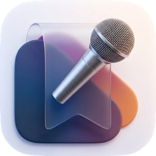

<p align="center">
  
</p>
<h1 align="center">Cue</h1>
<p align="center">Floating macOS teleprompter.<br>
Listens and auto-scrolls your script to match what you say.</p>
<p align="center"><strong>Version 0.1.0</strong> · macOS 14+ · Apple Silicon & Intel</p>
<p align="center"><a href="https://github.com/madebysan/cue/releases/latest"><strong>Download Cue</strong></a></p>

---

How hard can it be to build a teleprompter? It's basically scrolling text. I wanted to push it a bit more. What if the scrolling matched your voice cadence and speech? What if you start going off-rails and don't follow the script, will the teleprompter pause for you to regroup before continuing scrolling?

It's useful when recording videos to camera: tutorials, talking heads, pitch recordings, product walkthroughs. Anything where you want to keep your eyes near the camera while also reading a prepared script.

## Features

- **Voice-cadence scrolling.** Catches up when you pause, rephrase, or skip lines.
- **Invisible to screen share and screenshots** by default, so it doesn't leak into recordings.
- **Floats above fullscreen apps** and stays put when you switch Spaces.
- On-device speech recognition via the macOS Speech Recognizer. Nothing leaves your Mac.
- Works with AirPods and Bluetooth mics via the AVCaptureSession path.

## How it works

Paste your script into the floating window and press play. After a 3-2-1 countdown the app starts listening via the macOS speech recognizer, matches what you say to positions in the script, and scrolls so your current line stays near the top. Pause, rephrase, or skip ahead and the matcher catches up within a few words.

The window is invisible to screen share and screenshots by default, sits above full-screen apps, and crosses Spaces. A subtle ✨ menu bar icon shows or hides it.

## Requirements

- macOS 14 (Sonoma) or later (tested on macOS 26.3)
- Microphone access and Speech Recognition access
- Siri & Dictation enabled in System Settings
- AirPods or Bluetooth mics work via the AVCaptureSession path

## Running it

```bash
cd ~/Projects/cue

# Regenerate the Xcode project if you edit project.yml
/opt/homebrew/bin/xcodegen generate

# Build
xcodebuild \
  -project Cue.xcodeproj \
  -scheme Cue \
  -destination 'platform=macOS' \
  build

# Launch
APP_PATH=$(find ~/Library/Developer/Xcode/DerivedData -name "Cue.app" -path "*Debug*" | head -1)
open "$APP_PATH"
```

Or open `Cue.xcodeproj` in Xcode and press ⌘R.

## Keyboard shortcuts

- **Space.** Start / pause.
- **Escape.** Pause.
- **↑ / ↓.** Nudge position manually (5 words back / forward).
- **⌘,** opens Settings (opacity, text size defaults).
- **⌘Q** quits.

## Known limitations

- **TCC permission prompt on first launch.** The current DMG build doesn't reliably surface the macOS Speech Recognition and Microphone permission prompts from the `MenuBarExtra` Button closure. On a fresh machine you may need to grant permissions manually via System Settings → Privacy & Security → Speech Recognition + Microphone, then relaunch. Fix in progress.

## Feedback

Found a bug or have a feature idea? [Open an issue](https://github.com/madebysan/cue/issues).

## License

[MIT](LICENSE)

---

Made by [santiagoalonso.com](https://santiagoalonso.com)
