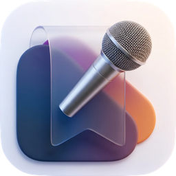
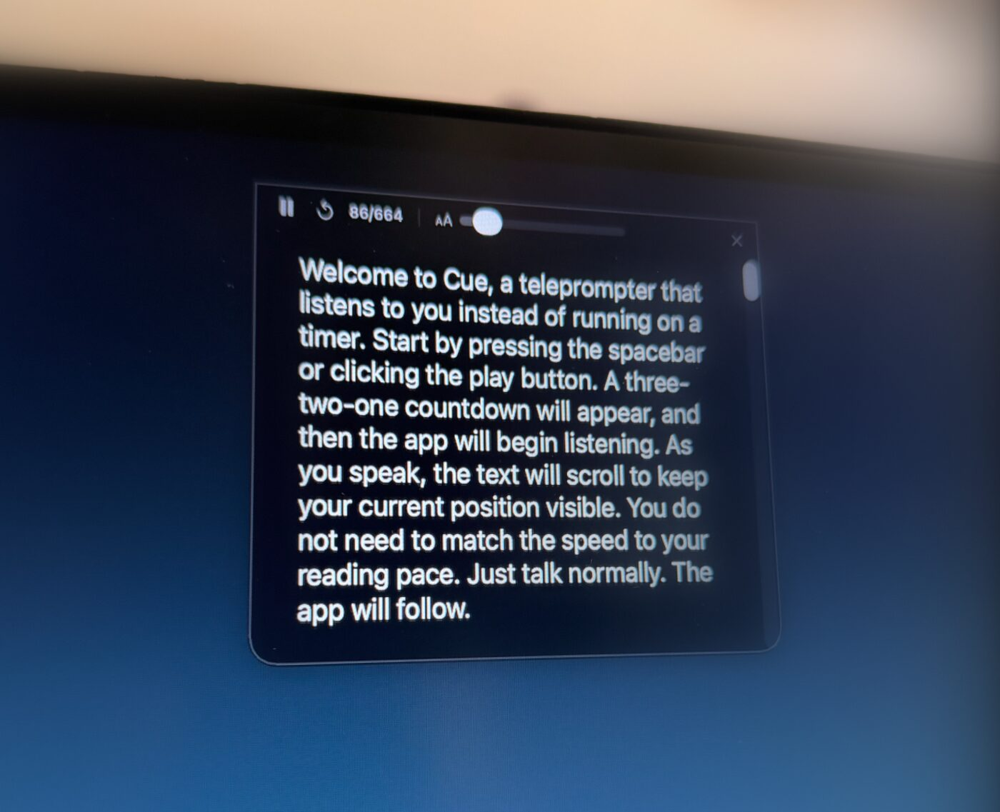

<p></p>

<h1>Cue</h1>

<p>A floating Mac teleprompter that follows your voice.<br>
It scrolls when you speak and waits when you leave the script.</p>

<p><strong>Version 0.1.0</strong> · macOS 14+ · Apple Silicon & Intel</p>

<p>
  
  
  
</p>

<p><a href="https://github.com/madebysan/cue/releases/latest">Download Cue</a></p>



## How it works

Paste your script into the floating window and press play. After a 3-2-1 countdown the app starts listening via the macOS speech recognizer, matches what you say to positions in the script, and scrolls so your current line stays near the top. Pause, rephrase, or skip ahead and the matcher catches up within a few words.

The window stays above full-screen apps and crosses Spaces. It is hidden from screen sharing and screenshots by default, so it does not appear in the recording. Speech recognition runs on your Mac and supports the built-in microphone, AirPods, and other Bluetooth inputs.

Cue is useful for tutorials, talking-head videos, pitch recordings, and product walkthroughs where you want to keep your eyes close to the camera while following a prepared script.

## Requirements

- macOS 14 (Sonoma) or later (tested on macOS 26.3)
- Microphone access and Speech Recognition access
- Siri & Dictation enabled in System Settings
- AirPods or Bluetooth mics work via the AVCaptureSession path

## Running it

```bash
cd ~/Projects/cue

# Regenerate the Xcode project if you edit project.yml
/opt/homebrew/bin/xcodegen generate

# Build
xcodebuild \
  -project Cue.xcodeproj \
  -scheme Cue \
  -destination 'platform=macOS' \
  build

# Launch
APP_PATH=$(find ~/Library/Developer/Xcode/DerivedData -name "Cue.app" -path "*Debug*" | head -1)
open "$APP_PATH"
```

Or open `Cue.xcodeproj` in Xcode and press ⌘R.

## Keyboard shortcuts

- **Space.** Start / pause.
- **Escape.** Pause.
- **↑ / ↓.** Nudge position manually (5 words back / forward).
- **⌘,** opens Settings (opacity, text size defaults).
- **⌘Q** quits.

## Known limitations

- **TCC permission prompt on first launch.** The current DMG build doesn't reliably surface the macOS Speech Recognition and Microphone permission prompts from the `MenuBarExtra` Button closure. On a fresh machine you may need to grant permissions manually via System Settings → Privacy & Security → Speech Recognition + Microphone, then relaunch. Fix in progress.

## Feedback

Found a bug or have a feature idea? [Open an issue](https://github.com/madebysan/cue/issues).

## License

[MIT](LICENSE)

Made by [santiagoalonso.com](https://santiagoalonso.com)
