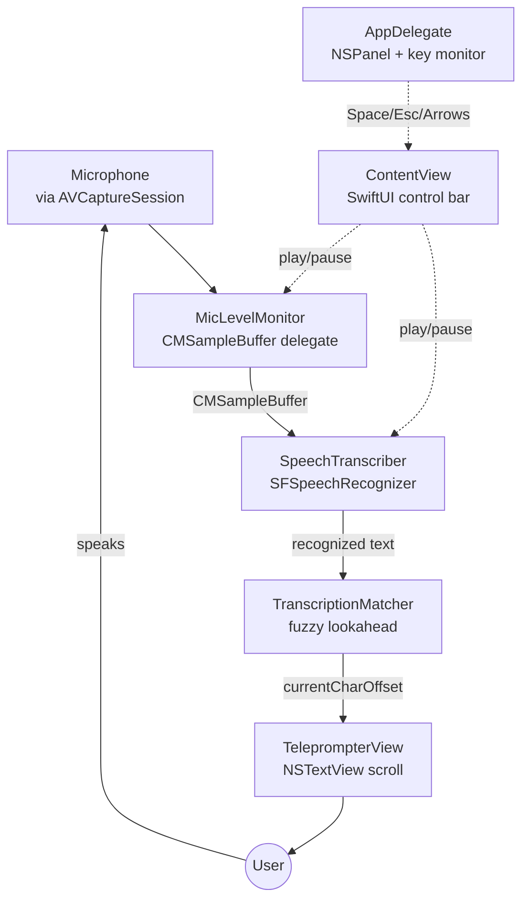
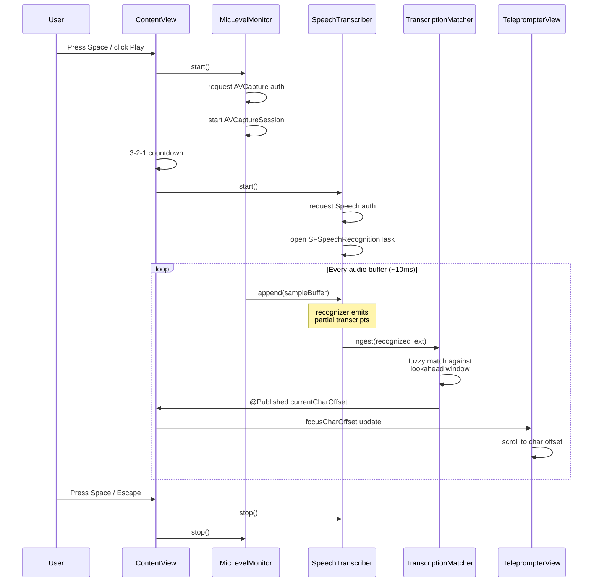

# Architecture

## System Overview

Cue is a single-window macOS floating utility. There is no backend, no database, no network call. The entire system is an audio pipeline: microphone → speech recognizer → fuzzy matcher → text view auto-scroll.

**The spine:** user's voice enters via `AVCaptureSession`, is forwarded as `CMSampleBuffer` into `SFSpeechRecognizer`, whose partial results stream into `TranscriptionMatcher`, which computes a character offset that `TeleprompterView` scrolls to. All five stages run live on every audio buffer (~every 10 ms).

## Request Lifecycle

Since this isn't a client-server app, the "request" is a user session: press Play, speak, press Pause.

## Component Interaction

**ContentView** is the central coordinator. It owns the three `@StateObject` services (`MicLevelMonitor`, `SpeechTranscriber`, `TranscriptionMatcher`) and wires them together in `hookUpMicToSpeech()`:

- `mic.onSampleBuffer` → `speech.append(sampleBuffer:)`
- `speech.onRecognized` → `matcher.ingest(_:)`
- `matcher.currentCharOffset` (via `@Published`) → `TeleprompterView.focusCharOffset`

Nothing is a direct reference; everything is wired by closures set at `.onAppear`. This keeps the services loosely coupled and testable in isolation.

**AppDelegate** is a peer of `ContentView`, not a parent. It hosts the `NSPanel`, installs the global key monitor (`NSEvent.addLocalMonitorForEvents`), and creates the menu bar status item. Static closures on `AppDelegate` let `ContentView` subscribe to keyboard events without needing a reference to it — see `AppDelegate.onSpacePressed`, `onArrowUp`, etc.

## Architectural Pattern

**Single-Window Utility** with **Observed Service Objects**:

- One visible window (an `NSPanel` pinned to the top of the screen)
- One root SwiftUI view (`ContentView`) that coordinates everything
- Services are plain Swift classes conforming to `ObservableObject`. Only state observed by the view body is marked `@Published`
- No navigation, no routing, no tabs, no scenes beyond the hidden Settings scene

Services are **one-way**: audio flows outward from `MicLevelMonitor` toward `TeleprompterView`. No service reads the result of a downstream service. This prevents feedback loops.

## Boundaries

This app interfaces with macOS system services at three boundaries:

| Boundary | API | Purpose |
|----------|-----|---------|
| Microphone | `AVCaptureSession` + `AVCaptureAudioDataOutput` | Audio input |
| Speech | `SFSpeechRecognizer` + `SFSpeechAudioBufferRecognitionRequest` | On-device transcription |
| Window | `NSPanel`, `NSStatusItem`, `NSEvent.addLocalMonitorForEvents` | Floating window + menu bar + keyboard |

There are **no external HTTP calls**, **no file writes** beyond the debug logger, and **no third-party Swift packages**.

## Threading Model

- **SwiftUI view body** + user actions: main thread
- **AVCaptureSession callbacks**: a dedicated capture queue (`DispatchQueue(label: "cue.capture", qos: .userInitiated)`)
- **Speech recognition callbacks**: Apple-managed background queue, results dispatched to main via `DispatchQueue.main.async`
- **Logger writes**: dedicated utility queue

Every `@Published` update crosses back to the main queue before mutating. No `@MainActor` annotations on service classes — see [Design-Decisions.md](Design-Decisions.md) for why.

## Dependencies

**Zero third-party Swift packages.** All capabilities are Apple-provided:

- `AVFoundation` — mic capture, audio buffer plumbing
- `Speech` — on-device speech recognition
- `AppKit` — `NSPanel`, `NSStatusItem`, `NSEvent`
- `SwiftUI` — view layer
- `CoreMedia` — `CMSampleBuffer` handling

Build-time tools:

- `xcodegen` (installed via Homebrew) — generates `Cue.xcodeproj` from `project.yml`
- `xcodebuild` — Apple's build tool

## Related

- [Data Flow](Data-Flow.md) — deeper trace of a single word flowing through the pipeline (consolidated here — no separate page)
- [Core Concepts](Core-Concepts.md) — glossary of audio/speech terms
- [Design Decisions](Design-Decisions.md) — why AVCaptureSession over AVAudioEngine, why fuzzy matching, etc.
