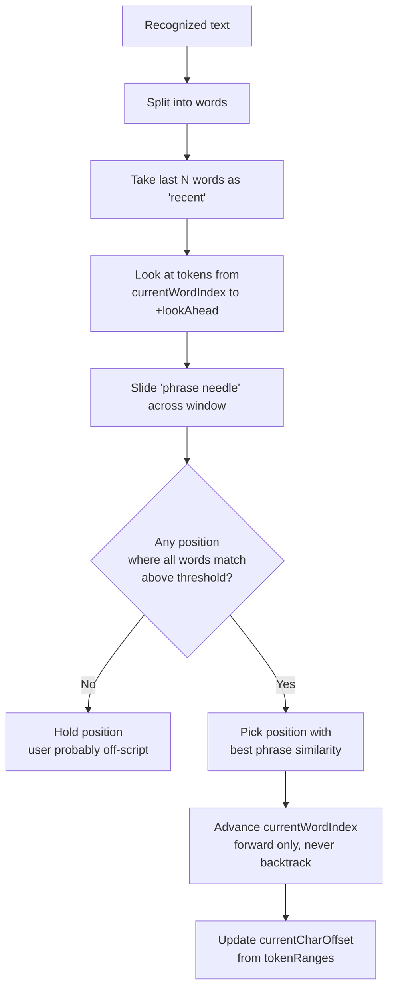

# TranscriptionMatcher

## Purpose

Maps streaming recognized speech back to a position in the script. Designed to tolerate misrecognition, off-script improvisation, skipped lines, and mispronunciations without jumping around wildly or getting stuck.

This is the most algorithmically interesting file in the project — and the one you'd port to a different UI or platform first.

## Location

`Cue/Services/TranscriptionMatcher.swift` (218 lines, pure Swift logic, no UI dependencies)

## Interface

```swift
final class TranscriptionMatcher: ObservableObject {
    @Published private(set) var currentWordIndex: Int
    @Published private(set) var currentCharOffset: Int
    @Published private(set) var totalTokens: Int

    func setScript(_ text: String)
    func reset()
    func setCurrentIndex(_ index: Int)  // for manual arrow-key override
    func ingest(_ recognizedText: String)
}
```

Pure inputs/outputs — no audio, no UI. Unit-testable with just strings.

## Internal Design

### Tokenization

`setScript(_:)` calls `Self.tokenize(text)`, which walks the string char-by-char and produces two parallel arrays:

- `tokens: [String]` — lowercased word forms, punctuation stripped
- `tokenRanges: [NSRange]` — each token's character range in the original (cased, punctuated) script

Keeping the original ranges is what lets `currentCharOffset` map back to a visible position in the `NSTextView` for scrolling.

### The core algorithm: rolling fuzzy lookahead

For each recognized transcript that arrives:



**Key design choices:**

- **Forward-only.** `windowStart = currentWordIndex`. We never scan backwards in the script. This is what prevents the matcher from jumping to an earlier occurrence of a common word.
- **Multi-word phrase needle** (default 3 words). Matching "the quick" against the lookahead is vastly more discriminating than matching "the" alone — common words don't cause false jumps.
- **Per-word threshold AND average-phrase threshold.** A needle only matches if every word clears `minWordSimilarity = 0.65` AND the average clears `minPhraseSimilarity = 0.55`. One terrible word torpedoes the whole match even if the average would pass.
- **Fuzzy, not exact.** Levenshtein edit distance normalized to a 0–1 similarity. Handles mispronunciations, minor misrecognitions ("mood" vs "moody" = similarity 0.8, still matches).

### Similarity scoring

```swift
static func similarity(_ a: String, _ b: String) -> Float {
    if a == b { return 1 }
    let maxLen = max(a.count, b.count)
    if maxLen == 0 { return 1 }
    let dist = Self.editDistance(a, b)
    return max(0, 1 - Float(dist) / Float(maxLen))
}
```

Standard Levenshtein with a rolling two-row DP (O(n*m) time, O(min(n,m)) space). Adequate for words up to ~20 chars; no optimization needed at typical script sizes.

### Tuning parameters

| Constant | Default | Effect of increasing | Effect of decreasing |
|----------|---------|---------------------|---------------------|
| `lookAhead` | 40 | Scroll catches up to larger skips | Slower drift recovery, stricter |
| `minWordSimilarity` | 0.65 | Fewer false matches, more "stuck" moments | Accepts worse misrecognition, risks drift |
| `minPhraseSimilarity` | 0.55 | Stricter phrase acceptance | Matches even with mediocre average |
| `phraseSize` | 3 | More discriminating, but "slower to latch" on first word | Faster to pick up, more false positives on common words |

All four are `private let`. User-facing tuning would go in `SettingsView`.

### Dedup

`lastRecognizedWordCount` tracks how many words the recognizer has returned so far. When a new transcript arrives, only the tail (last `phraseSize + 2` words) is considered — we don't re-match the prefix we've already consumed. This keeps `ingest()` cheap even as the cumulative transcript grows.

### Manual override

`setCurrentIndex(_:)` is called when the user presses arrow keys. It clamps to `[0, tokens.count]` and updates `currentCharOffset` accordingly. Because the matcher is forward-only, hitting arrow-up doesn't help unless you then stop speaking — otherwise the next ingested match will advance past wherever you rewound to.

## Behavior matrix

| User action | What the matcher does |
|-------------|----------------------|
| Reads the script verbatim | Advances one phrase at a time, smoothly |
| Mispronounces a word | Fuzzy match still advances |
| Skips a sentence | Jumps forward to wherever the next phrase matches in the lookahead |
| Talks about something random (off-script) | Holds position; nothing in the lookahead matches |
| Pauses mid-sentence | Holds position; no new recognized text to ingest |
| Speaks fast | Multiple phrases advance per recognition callback |
| Speaks slowly | Advances once per phrase; `TeleprompterView` smoothly follows |
| Backtracks in the script | Won't rewind — stays at max-seen position |
| Recognizer hallucinates | Hallucination word likely below threshold against lookahead; ignored |

## Constraints

- **Requires 3+ consecutive recognized words to advance reliably.** The first phrase after pressing play takes 1–2 seconds of speech to catch.
- **Identical-word script passages confuse the matcher.** "Buffalo buffalo buffalo" — multiple adjacent identical tokens = fuzzy match finds all positions equally good. In practice this doesn't happen in prose.
- **No language model.** The matcher doesn't know "the the the" is unlikely; it treats each word equivalently. If the recognizer emits spurious "the"s, the matcher may advance slightly. Not a practical issue.
- **English-only in spirit, not code.** Tokenization uses `CharacterSet.letters` + `CharacterSet.decimalDigits` — should work for other left-to-right languages. Not tested beyond English.

## Dependencies

- `Foundation` only. No UI, no audio, no network.
- `Logger` for one diagnostic log on `setScript`.

## Unit testing

Because the class is pure logic, you can test it with just strings:

```swift
let m = TranscriptionMatcher()
m.setScript("The quick brown fox jumps over the lazy dog.")
XCTAssertEqual(m.totalTokens, 9)
m.ingest("the quick brown")
XCTAssertEqual(m.currentWordIndex, 3)
m.ingest("the quick brown fox jumps")
XCTAssertEqual(m.currentWordIndex, 5)
m.ingest("and then I went to the store")  // off-script
XCTAssertEqual(m.currentWordIndex, 5)  // held position
m.ingest("and then I went jumps over the lazy dog")  // jump-ahead
XCTAssertEqual(m.currentWordIndex, 9)
```

Tracked in `backlog.md` — no unit tests exist yet.

## Related

- [SpeechTranscriber](SpeechTranscriber.md) — source of the `recognizedText` strings
- [TeleprompterView](TeleprompterView.md) — consumer of `currentCharOffset`
- [Design-Decisions](../Design-Decisions.md) — DD-002 (rolling fuzzy vs full alignment)
