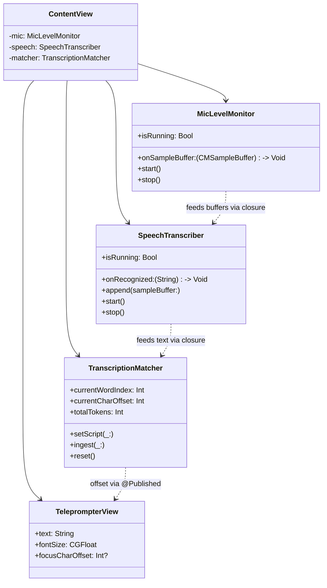

# Core Concepts

## Mental Model

The app is a **pipeline with feedback to the UI**. Every audio buffer from the microphone is a tick that advances the pipeline forward:

1. **Capture** — a CMSampleBuffer of audio lands
2. **Recognize** — the buffer joins an active speech recognition request; partial transcripts stream back
3. **Match** — the latest recognized text is compared against the script; position advances if a match is found
4. **Scroll** — the new character offset is pushed to the `TeleprompterView`, which scrolls the visible text

The pipeline is **forward-only**. Nothing downstream feeds back into upstream. The matcher never backtracks. The scroll never pulls audio. This is what keeps the system stable under rapid speech and out-of-script moments.

## Key Abstractions

The four services are independently testable. `TranscriptionMatcher` in particular has no knowledge of audio or UI — it's pure string logic.

## Glossary

**Script** — the text the user is reading aloud. Stored as a single `String` in `ContentView.script`. Editable via the built-in `TeleprompterView`.

**Token** — a single lowercased word from the script, with its character range in the original string preserved. `TranscriptionMatcher` tokenizes the script once in `setScript(_:)` and keeps `tokens: [String]` and `tokenRanges: [NSRange]` in parallel.

**Lookahead Window** — the slice of script tokens the matcher scans for the next match, starting from `currentWordIndex` and extending forward by `lookAhead` positions (default: 40 words). The matcher never scans backwards — this is what guarantees forward-only progress.

**Phrase** — the last 3 recognized words, treated as the "needle" when searching the lookahead window. Multi-word matching reduces false positives on common words like "the".

**Word Similarity** — a Levenshtein-based score from 0 to 1 comparing one recognized word to one script token. Required to exceed `minWordSimilarity = 0.65` for a character-level match.

**Phrase Similarity** — the average word similarity across the matched phrase. Required to exceed `minPhraseSimilarity = 0.55`. Lower threshold than word-level because averaging across good + mediocre matches should still count.

**Current Word Index** — the index into `tokens` of the last matched word. Drives where the window starts on the next `ingest()`, and where the teleprompter scrolls to.

**Current Char Offset** — the character position in the original script string, derived from `currentWordIndex` via `tokenRanges`. This is what `TeleprompterView` uses to compute scroll position via `NSLayoutManager.boundingRect(forGlyphRange:)`.

**Partial Result / Final Result** — `SFSpeechRecognizer` returns two kinds of results. Partials stream continuously during speech and are what drive the live match. Finals are emitted when the recognizer decides a segment is complete (typically after a pause) — we use them identically to partials in this app.

**On-Device Recognition** — Apple's speech recognizer supports running fully on-device (since macOS 10.15 + suitable hardware). Controlled via `SFSpeechAudioBufferRecognitionRequest.requiresOnDeviceRecognition`. Currently we set it to `false` in production for reliability — on-device occasionally failed silently during development. See [Design-Decisions.md](Design-Decisions.md).

**CMSampleBuffer** — CoreMedia's container for a chunk of audio data plus its format description. `AVCaptureAudioDataOutput` emits these to its delegate; `SFSpeechAudioBufferRecognitionRequest.appendAudioSampleBuffer(_:)` accepts them directly — no conversion needed.

**AVCaptureSession** — CoreMedia's pipeline for capturing audio/video. Preferred over AVAudioEngine for this app because AVAudioEngine's input tap is unreliable on macOS 26. Non-exclusive — coexists with Zoom/Meet/QuickTime.

**Floating Utility Panel** — an `NSPanel` configured with `.floating` level, `canJoinAllSpaces`, `fullScreenAuxiliary`, and `sharingType = .none`. Sits above every other app, across all Spaces, and is invisible to screen share.

**Matcher** — informal shorthand for `TranscriptionMatcher`. The brain of the voice-following behavior.

## Key Relationships

- **Matcher depends only on the script + recognized text.** You can unit-test the matcher with no audio at all — just feed it strings.
- **Services never reference each other directly.** They're wired by closures set in `ContentView.hookUpMicToSpeech()`. This keeps each service self-contained.
- **State lives in `ContentView` (SwiftUI state + AppStorage) and in the service classes (their own `@Published` vars).** There is no shared global state.

## Related

- [Architecture](Architecture.md) — how these concepts connect at runtime
- [Design Decisions](Design-Decisions.md) — why these abstractions were chosen
- [Components](Components/) — deep-dives into each service
